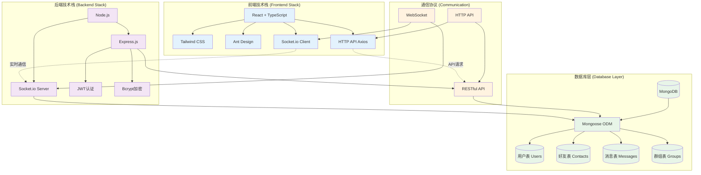
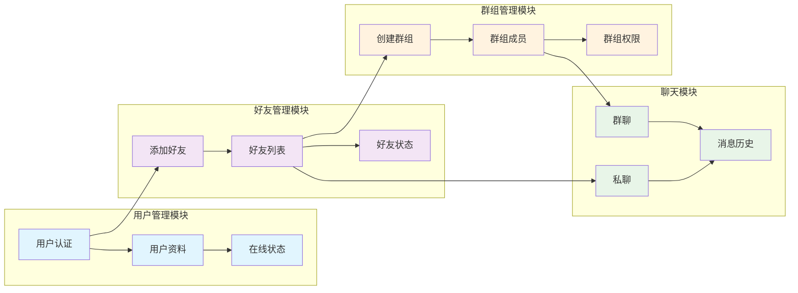
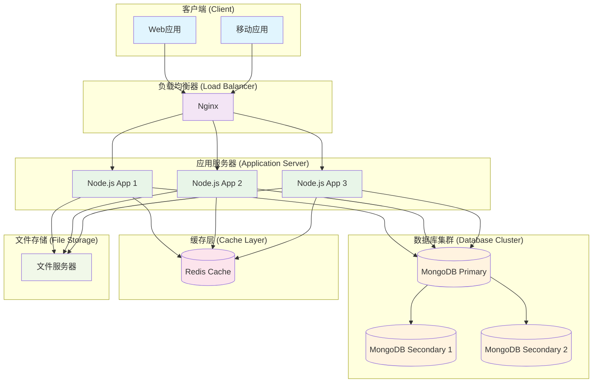
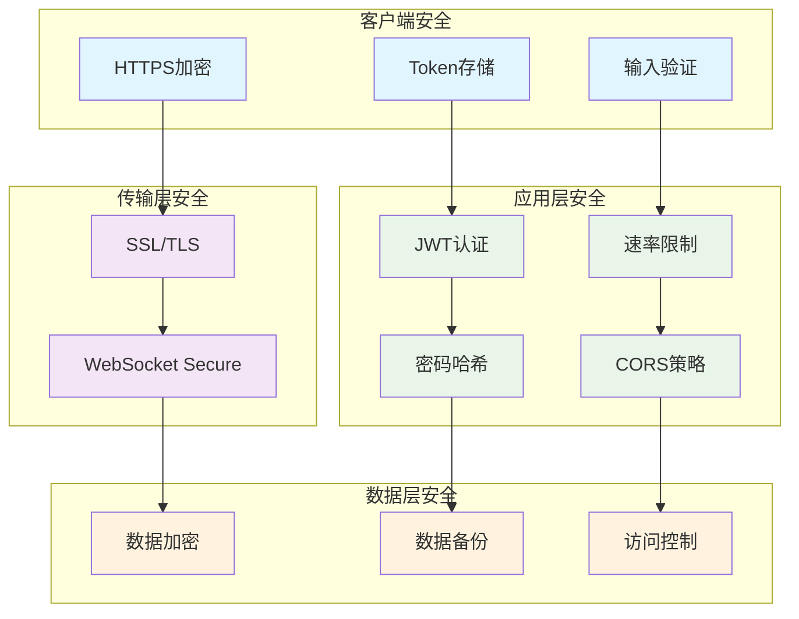

# 网络聊天系统架构图 - Mermaid版本

## 技术架构详细图



## 系统功能模块图



## 数据流程图

```mermaid
flowchart TD
    A[用户登录] --> B{验证用户}
    B -->|成功| C[建立WebSocket连接]
    B -->|失败| D[返回错误信息]
    
    C --> E[获取好友列表]
    C --> F[获取群组列表]
    C --> G[获取离线消息]
    
    E --> H[实时好友状态更新]
    F --> I[群组消息监听]
    G --> J[消息历史记录]
    
    K[发送消息] --> L{消息类型}
    L -->|私聊| M[路由到目标用户]
    L -->|群聊| N[广播到群组成员]
    
    M --> O[消息存储]
    N --> O
    O --> P[消息状态更新]
    
    H --> Q[UI状态更新]
    I --> Q
    J --> Q
    P --> Q
    
    classDef start fill:#e8f5e8
    classDef process fill:#e3f2fd
    classDef decision fill:#fff3e0
    classDef end fill:#fce4ec
    
    class A start
    class C,E,F,G,H,I,J,K,M,N,O,P,Q process
    class B,L decision
    class D end
```

## 系统部署架构图



## 安全架构图


